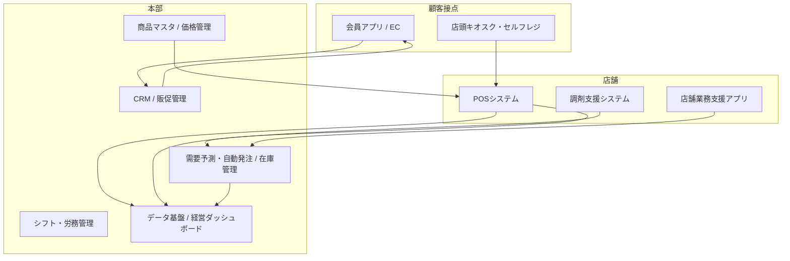

# ドラッグストアチェーン向け 開発ソフトウェア定義書

- 版数: 1.0
- 作成日: 2026-08-16
- 対象: 複数店舗を展開するドラッグストアチェーン(調剤併設を含む)

---

## 1. 目的と背景

ドラッグストアチェーンの事業は「物販(医薬品・化粧品・日用品・食品)」と「調剤・ヘルスケアサービス」の2軸で構成される。
本書は、チェーン全体の売上最大化・在庫最適化・法令遵守・顧客体験向上を実現するために開発すべきソフトウェア群を定義する。

### 経営課題とソフトウェアの対応

| 経営課題 | 対応するシステム |
|---|---|
| 廃棄ロス・欠品による機会損失 | 需要予測・自動発注、在庫管理 |
| 人手不足・店舗業務の負荷 | シフト管理、店舗業務支援アプリ、セルフレジ |
| 医薬品販売の法令遵守(薬機法) | POSの販売制御、資格者管理 |
| 顧客の来店頻度低下・EC競合 | 会員アプリ、パーソナライズ販促、OMO |
| 調剤の待ち時間・薬歴管理 | 調剤システム、処方箋事前受付、電子薬歴 |
| 本部の意思決定の遅さ | 経営ダッシュボード、データ基盤 |

---

## 2. システム全体構成

---

## 3. 開発すべきソフトウェア定義

### 3.1 POS・店頭販売システム 【優先度: 最高】

売上の起点であり、医薬品販売の法令遵守を機械的に担保する中核システム。

**主要機能**
- 商品スキャン(JAN/GS1)、値引・割引、各種決済(現金/クレジット/QR/電子マネー/ポイント併用)
- **医薬品リスク区分別の販売制御**: 第1類医薬品は薬剤師在勤時のみ販売可、要指導医薬品の対面確認、濫用等のおそれのある医薬品(OTC)の数量制限・年齢確認フロー
- 税率混在対応(軽減税率8%/標準10%)、インボイス対応レシート
- セルフレジ・セミセルフレジモード(医薬品はスタッフ呼び出しに自動切替)
- オフライン継続販売(ネットワーク断でもローカルで会計継続、復旧後同期)
- 電子レシート、返品・取消、レジ精算・日次締め

**非機能要件**: スキャン→会計完了まで1商品0.5秒以内 / 稼働率99.9% / PCI DSS準拠

---

### 3.2 商品マスタ・価格管理システム 【優先度: 最高】

チェーン全店の商品情報と価格の「唯一の正」(Single Source of Truth)。

**主要機能**
- 商品マスタ管理: JANコード、メーカー、カテゴリ、医薬品リスク区分、税率区分、ロット・使用期限管理要否
- 価格管理: 全店一律価格/地域別・店舗別価格、特売・チラシ価格の期間予約、競合価格調査データの取込
- 棚割(プラノグラム)管理と店舗への配信
- 新商品登録・廃番ワークフロー(承認フロー付き)
- 全システムへのマスタ配信API(POS・EC・アプリ・発注が同一マスタを参照)

---

### 3.3 需要予測・自動発注システム 【優先度: 高】

廃棄ロスと欠品の同時削減が目的。ドラッグストアは季節性(花粉症薬・日焼け止め・カイロ等)と販促の影響が大きく、予測精度が利益に直結する。

**主要機能**
- 店舗×SKU別の需要予測(曜日・天候・気温・花粉飛散量・販促・地域イベントを特徴量とする機械学習モデル)
- 発注推奨量の自動算出と自動発注(担当者による修正・承認も可能)
- 使用期限管理品の先入先出・値引タイミング推奨
- 物流センター/ベンダー直送の発注先自動振り分け
- 欠品率・廃棄率・在庫回転のKPIモニタリング

**KPI目標例**: 欠品率 2%以下 / 廃棄ロス 前年比▲20% / 発注作業時間 1店舗あたり1日30分以下

---

### 3.4 在庫管理・店間移動システム 【優先度: 高】

**主要機能**
- リアルタイム論理在庫(販売・入荷・返品・廃棄・棚卸を即時反映)
- ハンディターミナル/スマホによる入荷検品・棚卸・廃棄登録
- 店間在庫照会と店間移動指示(欠品時に近隣店舗から融通)
- ロット・使用期限トレーサビリティ(医薬品・食品の回収対応)
- EC・アプリからの店舗在庫表示(取り置き・店頭受取の裏付け)

---

### 3.5 調剤薬局支援システム 【優先度: 高】(調剤併設店向け)

**主要機能**
- 電子処方箋・マイナ保険証(オンライン資格確認)連携
- 処方監査支援: 併用禁忌・重複投薬・アレルギーチェック
- 電子薬歴、服薬指導記録、トレーシングレポート
- レセプト(調剤報酬請求)作成
- **処方箋事前送信・待ち時間通知**(会員アプリ連携): 処方箋撮影送信→調剤完了をプッシュ通知→店頭受取
- 調剤在庫・分割販売・不動在庫の薬局間融通

**制約**: 医療情報システムの安全管理ガイドライン準拠、薬歴データは物販データと分離管理し、本人同意の範囲でのみ販促に利用。

---

### 3.6 会員アプリ・CRM/販促システム 【優先度: 高】

来店頻度と客単価を高める顧客接点の中核。

**主要機能**
- 会員証(バーコード/コード決済)、ポイント残高・履歴
- パーソナライズクーポン(購買履歴ベースのレコメンド。医薬品購買履歴の利用は本人同意・法令の範囲内に限定)
- チラシ・特売情報、店舗検索、在庫確認、取り置き
- 処方箋送信・服薬リマインダー等のヘルスケア機能
- セグメント配信(プッシュ通知/メール)、キャンペーン管理、効果測定(A/Bテスト)
- ネット注文→店頭受取(BOPIS)・宅配

---

### 3.7 店舗業務支援アプリ(従業員向け) 【優先度: 中】

**主要機能**
- 本部→店舗の業務指示・実施報告(写真付き)、店舗間ナレッジ共有
- 売価変更・POP出力、棚割変更作業の指示と完了確認
- 発注推奨の確認・修正(3.3のモバイルUI)
- 商品問い合わせ検索(成分・用法・代替品。OTC接客支援)
- マニュアル・eラーニング(登録販売者の継続研修管理)

---

### 3.8 シフト・労務管理システム 【優先度: 中】

**主要機能**
- **資格者配置制約を組み込んだシフト自動作成**: 第1類医薬品販売時間帯には薬剤師、一般用医薬品販売には薬剤師または登録販売者が必ず配置されるよう制約充足で自動編成
- スタッフのシフト希望提出・交代申請(スマホ)
- 勤怠打刻、労働時間・休憩の法令チェック、給与システム連携
- 店舗の時間帯別客数予測と連動した必要人時の算出

---

### 3.9 データ基盤・経営ダッシュボード 【優先度: 中】

**主要機能**
- 全システムのデータを統合するDWH/データレイク(売上・在庫・会員・調剤(匿名化)・勤怠)
- 経営ダッシュボード: 日次売上速報、店舗別・カテゴリ別粗利、在庫・廃棄、人時生産性
- ID-POS分析(バスケット分析、併買、客層×時間帯)
- メーカー・卸向けデータ提供(将来の収益化オプション)

---

## 4. 開発優先順位とロードマップ

| フェーズ | 期間目安 | 開発対象 | ねらい |
|---|---|---|---|
| Phase 1 | 0〜9ヶ月 | 商品マスタ・価格管理 / POS | 販売の基盤と法令遵守の機械化 |
| Phase 2 | 6〜15ヶ月 | 在庫管理 / 需要予測・自動発注 | ロス削減で投資原資を創出 |
| Phase 3 | 12〜21ヶ月 | 会員アプリ・CRM / 調剤支援連携 | 顧客体験とOMOの確立 |
| Phase 4 | 18〜27ヶ月 | 店舗業務支援 / シフト管理 / データ基盤拡充 | 生産性と意思決定の高度化 |

※ 調剤レセプト・電子薬歴、給与計算、会計などは成熟したパッケージ/SaaSの活用を第一候補とし、自社開発は「競争優位に直結する領域(需要予測、アプリ/CRM、POSの販売制御、データ基盤)」に集中する。

---

## 5. 共通アーキテクチャ・非機能要件

- **API基盤**: 全システムはAPI(REST/イベント駆動)で疎結合に連携。商品・会員・在庫・売上をコアエンティティとして統一ID管理
- **クラウド前提**: 店舗側はPOSのオフライン耐性のみエッジで担保し、他はクラウドネイティブ(コンテナ/マネージドDB)
- **セキュリティ/コンプライアンス**:
  - 個人情報保護法(購買履歴・会員情報)、医療情報の安全管理ガイドライン(調剤系)
  - 薬機法(医薬品リスク区分別販売ルール)、割賦販売法・PCI DSS(決済)
  - 監査ログ、権限管理(店舗/本部/薬剤師などロールベース)
- **可用性**: POS 99.9%以上、本部系 99.5%以上。POSはセンター障害時も販売継続可能であること
- **拡張性**: 店舗数増(〜1,000店規模)、SKU数(〜10万)に耐えるスケール設計

---

## 6. 成功指標(全体KPI)

| 指標 | 目標例 |
|---|---|
| 欠品率 | 2%以下 |
| 廃棄ロス金額 | 前年比 ▲20% |
| アプリ会員の売上構成比 | 50%以上 |
| 発注・棚卸などの店舗バックヤード作業時間 | ▲30% |
| 調剤待ち時間(事前送信利用時) | 店頭滞在10分以内 |
| レジ待ち時間(ピーク) | 3分以内 |
